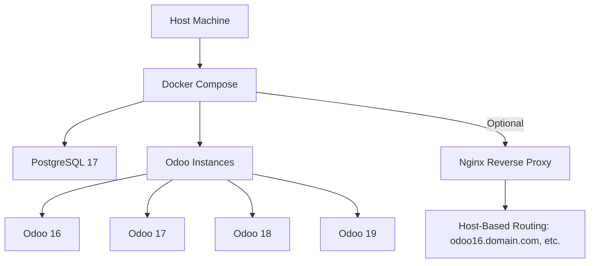

# Odoo Multi-Version Deployment (Docker + Optional Nginx)


> Deploy Odoo like a boss — multi-version, auto-tuned, zero drama.

---

## **Architecture**


---

## **Why This Exists**
Because manual Odoo setups are pain. This script is for:
- **Lazy DevSecOps engineers** who want speed without sacrificing security.
- Quick **multi-version test environments**.
- Medium-scale deployments (<100 active users per instance).

---

## **Features**
✅ Multi-version support (16–19)  
✅ Auto-tuned PostgreSQL based on your hardware  
✅ Optional Nginx with subdomain routing  
✅ Custom entrypoints, addons structure, logrotate  
✅ Performance tuner included  
✅ One script → full stack ready  

---

## **Quick Start**
```bash
chmod +x autonginx.sh
./autonginx.sh   # Bootstrap project
./manage.sh start
./manage.sh urls
```

---

## **Access URLs**
If you enabled **Nginx**:
```
http://odoo16.yourdomain.com
http://odoo17.yourdomain.com
http://odoo18.yourdomain.com
http://odoo19.yourdomain.com
```
Default port: `80` (customizable during setup).  
Using `localhost`? Add these to `/etc/hosts`:
```
127.0.0.1 odoo16.localhost
127.0.0.1 odoo17.localhost
127.0.0.1 odoo18.localhost
127.0.0.1 odoo19.localhost
```

If you skipped Nginx:
```
Odoo 16 → http://localhost:8069
Odoo 17 → http://localhost:8070
Odoo 18 → http://localhost:8071
Odoo 19 → http://localhost:8072
```

---

## **Database**
- PostgreSQL 17 auto-tuned for your system  
- Default credentials: `odoo / odoo`  
- Host: `localhost:5432`

---

## **Core Commands**
| Command | Description |
|---------|-------------|
| `./manage.sh start [VERSION]` | Start all or specific version |
| `./manage.sh stop [VERSION]` | Stop services |
| `./manage.sh urls` | Show access URLs |
| `./manage.sh config VERSION` | Edit config file |
| `./manage.sh scaffold MODULE VERSION` | Create new module |
| `./manage.sh update VERSION` | Update module list |
| `./manage.sh backup VERSION` | Backup DB + filestore |
| `./manage.sh restore DB.sql VERSION [filestore.tar.gz]` | Restore backup |
| `./manage.sh clean` | Remove containers & volumes |
| `./manage.sh init` | Auto-initialize databases |

---

## **Adding Custom Modules**
```bash
# Method 1: Scaffold
./manage.sh scaffold my_module 17

# Method 2: Copy existing module
cp -r /path/to/my_module ./17-addons/custom/
./manage.sh restart 17
```

---

## **Performance Tuning**
Run the built-in tuner:
```bash
./conf/performance-tuner.sh
```
It suggests optimal workers & memory settings based on your hardware.

---

## **Ideal Use Cases**
- **Medium-scale deployments** (<100 active users per instance)
- **Multi-version dev environments**
- **Migration testing**
- **Demo setups for clients**

---

## **Next Steps**
- `cd your-project`
- `./manage.sh start`
- `./manage.sh init` (first run)
- `./manage.sh urls`

---

### **Pro Tips**
- Use **Enterprise edition** for full feature set (prompted during setup).
- Enable **Nginx** for cleaner URLs & better security.
- For production: switch configs with:
```bash
./manage.sh production VERSION
```

---

> Because life’s too short for manual configs.
