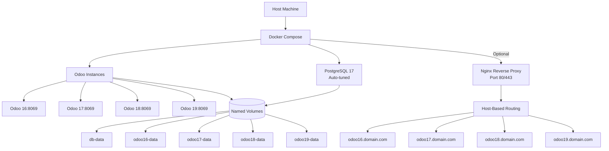

# Odoo Multi-Version Deployment Script


> Deploy multiple Odoo versions simultaneously with Docker Compose, optional Nginx reverse proxy, and automatic system optimization. Zero manual configuration, production-ready in minutes.

---

## Table of Contents

- [Architecture](#architecture)
- [Why This Exists](#why-this-exists)
- [Features](#features)
- [System Requirements](#system-requirements)
- [Quick Start](#quick-start)
- [Deployment Scenarios](#deployment-scenarios)
- [Access URLs](#access-urls)
- [Management Commands](#management-commands)
- [Configuration](#configuration)
- [Custom Modules](#custom-modules)
- [Performance Tuning](#performance-tuning)
- [Nginx Reverse Proxy](#nginx-reverse-proxy)
- [Backup & Restore](#backup--restore)
- [Production Deployment](#production-deployment)
- [Troubleshooting](#troubleshooting)
- [Contributing](#contributing)
- [License](#license)

---

## Architecture



### Architecture Highlights

- **Container Isolation**: Each Odoo version runs in its own container
- **Shared Database**: Single PostgreSQL 17 instance serves all versions
- **Persistent Storage**: Docker named volumes for data persistence
- **Optional Proxy**: Nginx provides clean URLs and SSL termination
- **Auto-Configuration**: System resources detected and optimized automatically

---

## Why This Exists

Manual Odoo deployments are time-consuming and error-prone. This script eliminates the pain by providing:

- **Rapid Deployment**: From zero to running Odoo in under 5 minutes
- **Multi-Version Support**: Test migrations, run parallel versions for different departments
- **Zero Configuration**: Auto-detects system resources and tunes accordingly
- **Production Ready**: Includes security hardening, performance optimization, and backup tools
- **Developer Friendly**: Hot-reload support, custom module scaffolding, shell access

**Ideal for:**
- DevSecOps engineers who value automation and security
- Businesses running multiple Odoo versions during migration periods
- Development teams testing custom modules across versions
- Small to medium deployments (<100 concurrent users, <100k daily visitors per instance)
- Quick demo environments for clients or sales teams

---

## Features

### Core Features
- Multi-version Odoo deployment (16, 17, 18, 19)
- Community and Enterprise edition support
- Docker Compose orchestration with health checks
- SELinux-compatible volume mounts (`:Z` flags)
- Custom entrypoints with proper configuration loading
- Automatic port conflict detection and resolution

### Database & Performance
- PostgreSQL 17 with auto-tuned configuration
- Resource-aware worker calculation (CPU + RAM analysis)
- Consistent 2GB memory allocation per worker
- Connection pooling and autovacuum optimization
- Query performance logging and monitoring

### Nginx Reverse Proxy (Optional)
- Host-based routing with subdomains
- Wildcard DNS support (sslip.io integration)
- Rate limiting on login and API endpoints
- WebSocket/longpolling support
- Static file caching with 1-year expiration
- SSL/TLS ready (manual certificate configuration)

### Development Tools
- Custom module scaffolding
- Requirements.txt support with version-specific pip handling
- Hot-reload mode for rapid development
- Shell access to containers
- Live log streaming
- Performance analysis tool

### Operations
- One-command backup and restore (database + filestore)
- Production/development configuration switching
- Debug mode with detailed logging
- Resource monitoring (CPU, memory, network)
- Logrotate configuration included
- Clean/reset commands for fresh starts

---

## System Requirements

### Minimum Requirements
- **CPU**: 2 cores
- **RAM**: 4GB
- **Disk**: 10GB available space
- **OS**: Linux (Ubuntu 20.04+, Debian 11+, RHEL 8+, or equivalent)
- **Docker**: 20.10 or newer
- **Docker Compose**: 2.0 or newer

### Recommended (for 100 concurrent users)
- **CPU**: 4+ cores
- **RAM**: 8GB+
- **Disk**: 50GB+ SSD
- **Docker**: 24.0+
- **Docker Compose**: 2.20+

### Software Dependencies
- `bash` 4.0+
- `docker` and `docker compose`
- `bc` (for calculations)
- `nc` or `netstat` (for port checking)
- `free`, `nproc` (usually pre-installed)

---

## Quick Start

### 1. Download the Script

```bash
# Clone the repository
git clone https://github.com/yourusername/odoo-multi-deploy.git
cd odoo-multi-deploy

# Or download directly
wget https://raw.githubusercontent.com/yourusername/odoo-multi-deploy/main/autodeploy-nginx.sh
chmod +x autodeploy-nginx.sh
```

### 2. Run the Deployment Script

```bash
./autodeploy-nginx.sh
```

### 3. Interactive Prompts

The script will ask:
- **Project name**: Alphanumeric identifier (e.g., `my-odoo`)
- **Edition**: Community (1) or Enterprise (2)
- **Versions**: Comma-separated (default: 16,17,18,19)
- **Nginx proxy**: Yes (y) or No (n)
- **Domain configuration**: sslip.io (1), localhost (2), or custom (3)
- **Ports**: Nginx port (default: 80) or Odoo starting port (default: 8069)

### 4. Start the Services

```bash
cd your-project-name
./manage.sh start
```

### 5. Initialize Databases (First Run Only)

```bash
./manage.sh init
```

### 6. Access Your Instances

```bash
./manage.sh urls
```

**Default credentials**: `admin` / `admin123`

---

## Deployment Scenarios

### Scenario 1: Local Development (No Nginx)

```bash
./autodeploy-nginx.sh

# Prompts:
Project name: dev-odoo
Edition: 1 (Community)
Versions: 17,18
Include Nginx proxy? N
Starting host port: 8069
```

**Access:**
- Odoo 17: http://localhost:8069
- Odoo 18: http://localhost:8070

**Use case**: Local development, testing migrations, custom module development.

---

### Scenario 2: Team Environment with Nginx + sslip.io

```bash
./autodeploy-nginx.sh

# Prompts:
Project name: team-erp
Edition: 1 (Community)
Versions: 16,17,18
Include Nginx proxy? Y
Nginx port: 80
Domain: 1 (sslip.io)
```

**Access:**
- Odoo 16: http://odoo16.127-0-0-1.sslip.io
- Odoo 17: http://odoo17.127-0-0-1.sslip.io
- Odoo 18: http://odoo18.127-0-0-1.sslip.io

**Use case**: Team testing, no DNS configuration required, clean URLs.

---

### Scenario 3: Production with Custom Domain

```bash
./autodeploy-nginx.sh

# Prompts:
Project name: prod-erp
Edition: 2 (Enterprise)
Versions: 18
Include Nginx proxy? Y
Nginx port: 80
Domain: 3 (Custom)
Enter domain: erp.company.com
```

**Access:**
- Odoo 18: http://odoo18.erp.company.com

**Additional steps:**
1. Configure DNS A records pointing to your server IP
2. Set up SSL certificates (see [Production Deployment](#production-deployment))
3. Switch to production config: `./manage.sh production 18`

**Use case**: Production deployment with professional URLs.

---

### Scenario 4: Non-Conflicting Port (Nginx on Custom Port)

```bash
./autodeploy-nginx.sh

# Prompts:
Project name: demo-odoo
Edition: 1
Versions: 17
Include Nginx proxy? Y
Nginx port: 8080
Domain: 2 (localhost)
```

**Access:**
- Odoo 17: http://odoo17.localhost:8080

**Add to /etc/hosts:**
```bash
sudo bash -c 'echo "127.0.0.1 odoo17.localhost" >> /etc/hosts'
```

**Use case**: Running alongside other services on port 80, quick demos.

---

## Access URLs

### With Nginx (Host-Based Routing)

```
http://odoo16.yourdomain.com
http://odoo17.yourdomain.com
http://odoo18.yourdomain.com
http://odoo19.yourdomain.com
```

**Using sslip.io (automatic DNS):**
```
http://odoo16.127-0-0-1.sslip.io
http://odoo17.127-0-0-1.sslip.io
```
*No /etc/hosts configuration required*

**Using localhost:**
Add to `/etc/hosts`:
```bash
sudo bash -c 'cat >> /etc/hosts << EOF
127.0.0.1 odoo16.localhost
127.0.0.1 odoo17.localhost
127.0.0.1 odoo18.localhost
127.0.0.1 odoo19.localhost
EOF'
```

### Without Nginx (Direct Access)

```
Odoo 16 → http://localhost:8069 (longpolling: 9069)
Odoo 17 → http://localhost:8070 (longpolling: 9070)
Odoo 18 → http://localhost:8071 (longpolling: 9071)
Odoo 19 → http://localhost:8072 (longpolling: 9072)
```

### Database Access

```
Host: localhost
Port: 5432
User: odoo
Password: odoo
```

**Connect with psql:**
```bash
psql -h localhost -U odoo -d postgres
```

---

## Management Commands

The script generates a `manage.sh` utility for all operations:

### Service Control

```bash
./manage.sh start           # Start all services
./manage.sh start 17        # Start only Odoo 17
./manage.sh stop            # Stop all services
./manage.sh stop 17         # Stop Odoo 17
./manage.sh restart 17      # Restart Odoo 17
```

### Information & Logs

```bash
./manage.sh urls            # Show all access URLs with status
./manage.sh logs            # Stream logs from all containers
./manage.sh logs 17         # Stream logs from Odoo 17
./manage.sh monitor         # Show resource usage (CPU, RAM)
./manage.sh monitor 17      # Show resource usage for Odoo 17
```

### Configuration

```bash
./manage.sh config 17       # Edit Odoo 17 configuration
./manage.sh production 17   # Switch to production config
./manage.sh development 17  # Switch to development config
./manage.sh debug 17        # Enable debug mode (single-threaded)
```

### Module Management

```bash
./manage.sh scaffold my_module 17       # Create new module
./manage.sh update 17                   # Update module list
./manage.sh shell 17                    # Open bash shell in container
```

### Backup & Restore

```bash
./manage.sh backup 17                                    # Backup database + filestore
./manage.sh restore backups/odoo17_20240101.sql 17       # Restore database only
./manage.sh restore backup.sql 17 filestore.tar.gz       # Restore both
```

### Maintenance

```bash
./manage.sh init            # Initialize databases (first run)
./manage.sh performance     # Run performance analysis
./manage.sh clean           # Remove containers and volumes
./manage.sh reset           # Complete reset (removes all data)
```

---

## Configuration

### Directory Structure

```
your-project/
├── docker-compose.yml              # Container orchestration
├── manage.sh                       # Management utility
├── init-setup.sh                   # Database initialization
├── README.md                       # Project-specific documentation
├── .gitignore
├── conf/
│   ├── nginx/
│   │   ├── nginx.conf              # Main Nginx config
│   │   └── conf.d/odoo.conf        # Odoo-specific routing
│   ├── postgresql/
│   │   ├── postgresql.conf         # Auto-tuned PostgreSQL
│   │   └── pg_hba.conf             # Authentication rules
│   └── performance-tuner.sh        # Resource analysis tool
├── 17-config/
│   ├── odoo.conf                   # Development config
│   ├── odoo-production.conf        # Production config template
│   ├── entrypoint.sh               # Custom entrypoint script
│   ├── requirements.txt            # Python dependencies
│   └── logrotate                   # Log rotation config
├── 17-addons/
│   ├── custom/                     # Your custom modules
│   ├── third-party/                # External modules
│   ├── enterprise/                 # Official Enterprise (if applicable)
│   └── industry/                   # Industry-specific modules
├── 18-config/
├── 18-addons/
└── backups/                        # Created on first backup
```

### Key Configuration Files

#### odoo.conf (Development)
```ini
[options]
# Database
db_host = db
db_user = odoo
db_password = odoo

# Server
addons_path = /usr/lib/python3/dist-packages/odoo/addons,/mnt/custom-addons
admin_passwd = admin123
http_port = 8069
gevent_port = 8072

# Performance (auto-configured)
workers = 3                        # Based on CPU cores
limit_memory_hard = 2147483648     # 2GB
limit_memory_soft = 1825361100     # 1.7GB

# Development
proxy_mode = False
list_db = True
log_level = info
```

#### odoo-production.conf
```ini
[options]
# Production settings
workers = 9                        # (CPU * 2) + 1
proxy_mode = True
list_db = False
db_filter = ^%d$
log_level = warn
session_cookie_secure = True
```

### Auto-Tuned PostgreSQL Settings

Based on detected system resources:

```ini
# Example for 4-core, 8GB system
shared_buffers = 2048MB            # 25% of RAM
effective_cache_size = 6144MB      # 75% of RAM
maintenance_work_mem = 512MB       # ~6% of RAM
work_mem = 128MB                   # RAM / (cores * 4)
max_connections = 200
```

---

## Custom Modules

### Method 1: Scaffold New Module

```bash
./manage.sh scaffold my_custom_module 17
cd 17-addons/custom/my_custom_module
# Edit __manifest__.py, models/, views/, etc.
./manage.sh restart 17
```

### Method 2: Copy Existing Module

```bash
cp -r /path/to/existing_module ./17-addons/custom/
./manage.sh restart 17
```

### Method 3: Clone from Repository

```bash
cd 17-addons/third-party
git clone https://github.com/OCA/web.git
./manage.sh restart 17
```

### Installing Python Dependencies

Add packages to `{VERSION}-config/requirements.txt`:

```txt
# Additional packages
phonenumbers>=8.12.0
openpyxl>=3.0.0
python-ldap>=3.3.0
```

Restart to install:
```bash
./manage.sh restart 17
```

### Enterprise Modules

For Enterprise edition:

```bash
cd 17-addons/enterprise
git clone --depth 1 --branch 17.0 https://github.com/odoo/enterprise.git .

cd ../industry
git clone --depth 1 --branch 17.0 https://github.com/odoo/industry.git .

./manage.sh restart 17
```

---

## Performance Tuning

### Automatic Analysis

Run the built-in performance analyzer:

```bash
cd your-project
./conf/performance-tuner.sh
```

**Output example:**
```
System Resources Detected:
  CPU Cores: 4
  Total RAM: 8GB (8192MB)

Worker Recommendations:
  Conservative: 5 workers (CPU + 1)
  Optimal: 9 workers (CPU * 2 + 1)

Memory Requirements:
  Per worker: 2048MB
  Conservative setup: 10240MB
  Optimal setup: 18432MB
  Available: 8192MB

Recommended Configuration:
  workers = 5
  limit_memory_hard = 2147483648  # 2GB
```

### Manual Tuning

Edit configuration:
```bash
./manage.sh config 17
```

**Critical parameters:**

| Parameter | Development | Production | Description |
|-----------|-------------|------------|-------------|
| `workers` | 0 or CPU+1 | (CPU*2)+1 | 0 = single-threaded with hot-reload |
| `limit_memory_hard` | 2147483648 | 2147483648 | 2GB hard limit per worker |
| `limit_memory_soft` | 1825361100 | 1825361100 | 1.7GB soft limit |
| `db_maxconn` | 64 | 64 | Max DB connections per worker |
| `proxy_mode` | False | True | Enable if behind Nginx/proxy |
| `list_db` | True | False | Hide database list in production |

### Resource Calculations

**Worker formula:**
```
Development: CPU_CORES + 1
Production: (CPU_CORES * 2) + 1
```

**Memory formula:**
```
Required RAM = (workers * 2048MB) + 1024MB (system)
```

**Example for 4-core system:**
- Conservative: 5 workers = 11264MB RAM required
- Optimal: 9 workers = 19456MB RAM required

---

## Nginx Reverse Proxy

### Why Use Nginx?

1. **Clean URLs**: Subdomains instead of ports
2. **Single Port**: All services on port 80/443
3. **Security**: Rate limiting, SSL termination
4. **Performance**: Static file caching, compression
5. **Production Ready**: SSL/TLS, WebSocket support

### Host-Based Routing

Each Odoo version gets its own subdomain:

```
odoo16.domain.com → Odoo 16 container (internal port 8069)
odoo17.domain.com → Odoo 17 container (internal port 8069)
odoo18.domain.com → Odoo 18 container (internal port 8069)
```

**Advantages:**
- No URL rewriting needed
- Better session isolation
- Easier SSL certificate management
- Cleaner user experience

### Wildcard DNS with sslip.io

**What is sslip.io?**
A DNS service that automatically resolves IPs embedded in subdomains.

**Example:**
```
odoo17.127-0-0-1.sslip.io → resolves to 127.0.0.1
odoo18.192-168-1-100.sslip.io → resolves to 192.168.1.100
```

**No /etc/hosts editing required!**

### SSL/TLS Configuration

After deployment, add SSL certificates:

**Using Let's Encrypt (Certbot):**

```bash
# Install Certbot
sudo apt install certbot python3-certbot-nginx

# Obtain certificates for all subdomains
sudo certbot --nginx \
  -d odoo16.yourdomain.com \
  -d odoo17.yourdomain.com \
  -d odoo18.yourdomain.com

# Test auto-renewal
sudo certbot renew --dry-run

# Add to crontab for auto-renewal
echo "0 3 * * * certbot renew --quiet" | sudo crontab -
```

Certbot will automatically:
- Update Nginx configuration
- Redirect HTTP to HTTPS
- Configure SSL certificates
- Set up auto-renewal

### Rate Limiting

Automatically configured:

```nginx
# Login attempts: 5 per minute
location ~* ^/web/(login|session/authenticate) {
    limit_req zone=login burst=5 nodelay;
}

# API calls: 20 per minute
location ~* ^/(xmlrpc|jsonrpc|api) {
    limit_req zone=api burst=10 nodelay;
}
```

---

## Backup & Restore

### Create Backup

**Backup database and filestore:**
```bash
./manage.sh backup 17
```

**Output:**
```
backups/odoo17_20240118_143022.sql        # Database dump
backups/filestore_17_20240118_143022.tar.gz  # Attachments, documents
```

### Restore Backup

**Restore database only:**
```bash
./manage.sh restore backups/odoo17_20240118.sql 17
```

**Restore database and filestore:**
```bash
./manage.sh restore backups/odoo17_20240118.sql 17 backups/filestore_17_20240118.tar.gz
```

**What happens:**
1. Odoo 17 container stops
2. Database is dropped and recreated
3. Backup is imported
4. Filestore is restored (if provided)
5. Container restarts

### Automated Backups

**Create backup script:**
```bash
cat > backup-all.sh << 'EOF'
#!/bin/bash
cd /path/to/your-project
for version in 16 17 18 19; do
    ./manage.sh backup $version
done
# Optional: Upload to S3 or remote storage
EOF
chmod +x backup-all.sh
```

**Add to crontab (daily at 2 AM):**
```bash
0 2 * * * /path/to/your-project/backup-all.sh
```

---

## Production Deployment

### Pre-Deployment Checklist

- [ ] Change default passwords (Odoo master, PostgreSQL)
- [ ] Configure SSL/TLS certificates
- [ ] Switch to production configuration
- [ ] Set `db_filter` to restrict database access
- [ ] Disable database listing (`list_db = False`)
- [ ] Configure firewall rules
- [ ] Set up monitoring (optional)
- [ ] Test backup and restore procedures
- [ ] Configure log rotation
- [ ] Document access credentials securely

### Step-by-Step Production Setup

#### 1. Deploy with Production Settings

```bash
./autodeploy-nginx.sh

# Choose:
- Edition: Enterprise (2)
- Nginx: Yes (y)
- Domain: Custom (3) → production.company.com
```

#### 2. Switch to Production Configuration

```bash
cd your-project
./manage.sh production 18
```

#### 3. Secure Master Password

Edit configuration:
```bash
./manage.sh config 18
```

Change:
```ini
admin_passwd = $(openssl rand -base64 32)  # Generate strong password
```

Save the password securely (password manager).

#### 4. Configure Database Filter

```ini
db_filter = ^%d$     # Only allows database matching domain name
list_db = False      # Hides database list
```

#### 5. Set Up SSL Certificates

```bash
sudo certbot --nginx -d odoo18.production.company.com
```

#### 6. Configure Firewall

```bash
# Allow only Nginx ports
sudo ufw allow 80/tcp
sudo ufw allow 443/tcp

# Block direct PostgreSQL access
sudo ufw deny 5432/tcp

# Enable firewall
sudo ufw enable
```

#### 7. Restart Services

```bash
./manage.sh restart 18
```

#### 8. Verify Production Settings

```bash
# Check Odoo is running
./manage.sh urls

# Verify SSL
curl -I https://odoo18.production.company.com

# Test database filter
# Try accessing: https://odoo18.production.company.com/web/database/selector
# Should redirect or show error
```

### Production Monitoring

**Resource monitoring:**
```bash
./manage.sh monitor 18
```

**Log monitoring:**
```bash
./manage.sh logs 18 | grep -i error
```

**Database size:**
```bash
docker compose exec db psql -U odoo -c "\l+"
```

---

## Troubleshooting

### Port Already in Use

**Error:**
```
Host port 8069 is already in use!
```

**Solution:**
The script automatically detects and adjusts ports. If issues persist:

```bash
# Find what's using the port
sudo lsof -i :8069
sudo netstat -tulpn | grep 8069

# Stop the conflicting service or choose different port
```

### Database Connection Failed

**Error:**
```
FATAL: password authentication failed for user "odoo"
```

**Solution:**

```bash
# Check PostgreSQL is running
docker compose ps db

# Restart database
docker compose restart db

# Check logs
docker compose logs db

# Verify connection
docker compose exec db psql -U odoo -c "SELECT version();"
```

### Nginx 502 Bad Gateway

**Error:**
Browser shows "502 Bad Gateway"

**Solution:**

```bash
# Verify Odoo containers are running
docker compose ps

# Check if Nginx can reach containers
docker compose exec nginx ping odoo17

# Check Nginx error logs
docker compose logs nginx | grep error

# Restart Nginx
docker compose restart nginx
```

### Out of Memory (OOM)

**Symptoms:**
- Container crashes unexpectedly
- Kernel messages about OOM killer
- Slow performance

**Solution:**

```bash
# Check current memory usage
./manage.sh monitor

# Reduce workers in odoo.conf
./manage.sh config 17
# Set: workers = 2 (or lower)

# Or decrease memory limits
# limit_memory_hard = 1610612736  # 1.5GB instead of 2GB

# Restart
./manage.sh restart 17

# Add swap space if needed
sudo fallocate -l 4G /swapfile
sudo chmod 600 /swapfile
sudo mkswap /swapfile
sudo swapon /swapfile
```

### Module Not Found After Install

**Error:**
```
Module 'my_module' not found
```

**Solution:**

```bash
# Verify module is in correct directory
ls -la 17-addons/custom/my_module

# Check manifest file exists
cat 17-addons/custom/my_module/__manifest__.py

# Update module list
./manage.sh update 17

# Restart container
./manage.sh restart 17

# Check logs for errors
./manage.sh logs 17 | grep my_module
```

### SSL Certificate Issues

**Error:**
```
SSL: CERTIFICATE_VERIFY_FAILED
```

**Solution:**

```bash
# Renew certificates
sudo certbot renew

# Check certificate expiration
sudo certbot certificates

# Test Nginx configuration
docker compose exec nginx nginx -t

# Reload Nginx
docker compose exec nginx nginx -s reload
```

### Performance Degradation

**Symptoms:**
- Slow page loads (>2 seconds)
- High CPU usage
- Timeout errors

**Solution:**

```bash
# Analyze current configuration
./conf/performance-tuner.sh

# Check resource usage
./manage.sh monitor 17

# Review PostgreSQL performance
docker compose exec db psql -U odoo -c "
SELECT pid, query_start, state, query 
FROM pg_stat_activity 
WHERE state != 'idle' 
ORDER BY query_start;
"

# Consider:
# 1. Increasing workers (if CPU is available)
# 2. Tuning PostgreSQL (conf/postgresql/postgresql.conf)
# 3. Adding more RAM
# 4. Enabling CDN for static files
```

---

## Contributing

This project is open source and community-driven. Contributions are welcome!

### How to Contribute

1. **Fork the repository**
2. **Create a feature branch**: `git checkout -b feature/your-feature`
3. **Commit changes**: `git commit -am 'Add new feature'`
4. **Push to branch**: `git push origin feature/your-feature`
5. **Submit Pull Request**

### Areas for Improvement

- Kubernetes/Helm chart deployment
- Ansible playbook version
- Advanced monitoring (Prometheus/Grafana integration)
- Multi-region deployment guides
- HA/failover configurations
- Automated testing framework
- Additional cloud provider templates (AWS, GCP, Azure)

### Reporting Issues

Open an issue on GitHub with:
- Detailed description
- Steps to reproduce
- System information (OS, Docker version, RAM, CPU)
- Relevant logs or error messages

---

## License

This project is licensed under the **GNU Affero General Public License v3.0 (AGPL-3.0)**.

### What This Means

- **Freedom to Use**: Use for any purpose, including commercial
- **Freedom to Modify**: Modify and create derivatives
- **Freedom to Share**: Distribute copies
- **Share Alike**: Derivatives must use AGPL-3.0
- **Network Use = Distribution**: If you run modified versions as a network service, you must share source code

### Why AGPL-3.0?

The AGPL-3.0 license ensures that improvements to this deployment tool benefit the entire Odoo community, even when used as a hosted service. This aligns with the open-source philosophy of transparency and collaboration.

**Full license text**: [LICENSE](LICENSE) or https://www.gnu.org/licenses/agpl-3.0.html

---

## Credits

Developed for the Odoo community by DevSecOps practitioners who believe in:
- **Automation over manual configuration**
- **Security by default**
- **Open source collaboration**
- **Documentation as code**

### Special Thanks

- Odoo SA for the excellent ERP platform
- Docker community for containerization best practices
- Nginx team for the robust reverse proxy
- PostgreSQL developers for the reliable database engine
- Contributors and testers who helped refine this tool

---

## Support & Community

- **Issues**: [GitHub Issues](https://github.com/yourusername/odoo-multi-deploy/issues)
- **Discussions**: [GitHub Discussions](https://github.com/yourusername/odoo-multi-deploy/discussions)
- **Odoo Community**: [Official Forums](https://www.odoo.com/forum)
- **Documentation**: [docs.claude.com](https://docs.claude.com)

---

**Built with pragmatism. Deployed with confidence.**

Deploy Odoo like a professional. Because life's too short for manual configuration.
